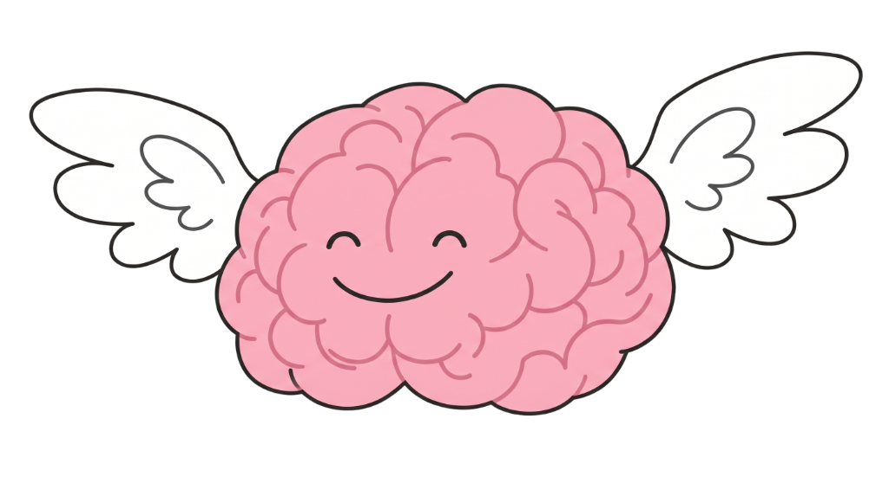

# 🧠 Brain-Bird: Muscle → Machine
**Electromyography-Powered Human-Computer Interaction**

Brain-Bird is an open-source, sub-$35 outreach demonstration that bridges the gap between neuromuscular biopotentials and digital interaction. It uses an **ESP32** and an **AD8232 EMG sensor** to read electrical activity from your forearm muscles when you squeeze, translating that bio-signal into a standard Bluetooth keyboard `Spacebar` press to play a custom HTML5 Canvas game.



## 🚀 The Stack
- **Hardware:** ESP32 Dev Board, AD8232 EMG Sensor Module
- **Firmware:** C++ (Arduino Core) with `ESP32-BLE-Keyboard`
- **Frontend:** Next.js, React, TailwindCSS, HTML5 Canvas 
- **Cost:** ~$35 Total Build

## 🛠️ Hardware Setup

### Wiring Diagram (AD8232 → ESP32)
| AD8232 Pin | ESP32 Pin | Notes |
| :--- | :--- | :--- |
| **3.3V** | 3V3 | Power |
| **GND** | GND | Common ground |
| **OUTPUT** | GPIO 35 | Analog signal (ADC) |
| **LO+** | GPIO 25 | Leads-off detect (optional) |
| **LO−** | GPIO 26 | Leads-off detect (optional) |
| **SDN** | 3V3 | Enable chip (tie high) |

*Optional LEDs and Tare button can be wired according to the pin definitions in the firmware.*

### Electrode Placement
For the best signal-to-noise ratio, target the **flexor digitorum superficialis** (the large muscle belly on the inner forearm):
1. **Red (Active):** ~2 inches below the elbow crease, centered on the muscle.
2. **Yellow (Reference):** ~2 inches distal from the Red electrode, along the same muscle fibers.
3. **Green (Ground):** Place on a bony, non-muscular area (like the back of the wrist or lateral elbow) for noise rejection.

## 💻 Firmware Installation
1. Install the Arduino IDE and set up the ESP32 board manager.
2. Install the [ESP32-BLE-Keyboard library by T-vK](https://github.com/T-vK/ESP32-BLE-Keyboard).
3. Open the firmware source code located on the homepage of the demo app.
4. Tune the `SQUEEZE_THRESHOLD` parameter via the Serial Montior (115200 baud) based on your resting noise floor.
5. Flash the ESP32. 
6. Pair the ESP32 to your computer via Bluetooth (it will appear as **"HijelHID KB"**).

## 🎮 Running the Web Demo
The frontend is a lightweight Next.js application containing the custom Brain-Bird canvas game.

```bash
# Install dependencies
npm install

# Start the development server
npm run dev
```
Open [http://localhost:3000](http://localhost:3000) to view the application in your browser. 
Once paired, every flex of your arm will trigger the bird to flap!

## 📜 License
This project is open-source and licensed under the MIT License. Built for STEM and Neuroscience outreach.
